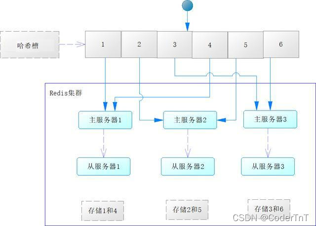
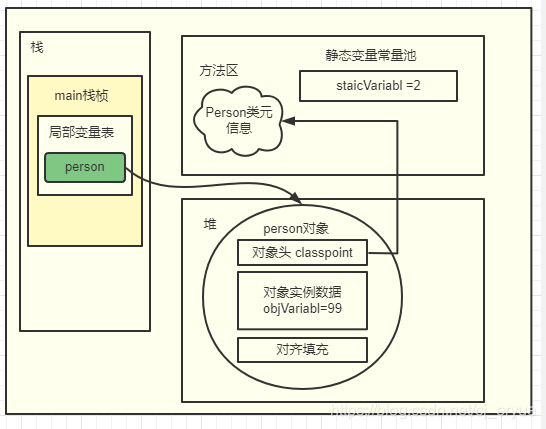

# 自我介绍
        你好，我叫徐超，2020年毕业于杭州电子科技大学计算机学院，在研究生期间主要的研究方向为NLP，主要研究成果
    是发了一遍专利和一篇sic期刊。2020.7月份入职中国太平洋寿险总公司，从事java后端开发。在这期间由于公司的需要
    呆过三个部门，第一个部门是团承保，主要负责老系统的维护和功能迭代。第二个部门主要参与系统的重构工作，从技术的选型
    到技术落地都深入参与了，经历过来一个新项目的整个周期。目前的工作是主要是负责低代码平台的落地。
  
# 面试问题
## redis的主要作用
 1. 作为缓存，保存热点数据
 2. sesson共享
 3. 简单的消息队列
## 为什么要用redis，为什么不可以用hashmap，list等代替
1. redis效率高
2. redis都是原子操作，要么成功要么失败
3. redis可以持久化到本地
   1. RDB: fork出一个子进程将redis中的数据写入到dump.rdb文件中，恢复数据时只需要读取该文件就可以
   恢复数据到某一个时间点，优点是效率很高，可以用于备份某一个时间点的数据，方便后期维护；缺点是由于写入文件的
   时间间隔是一分钟为单位的，所以会丢失相当一部分的数据。
   2. AOF: fork出一个子进程将写入的命令以追加的方式保存到文件中，写入的规则可以设置：比如可以有一条写入的命令
   就马上持久化到文件中，这种效率比较地底，但是很安全；第二种就是每一秒添加一次，这样最多就丢失一秒钟的数据，并且
   效率也比较高；第三种就是不去设置写入时间，与系统的写入间隔相同，这种效率最高，更RDB方式相似，但是丢失的数据也会增多。
   优点是保存的数据比较完整。缺点是没有RDB高。
## redis缓存穿透、击穿、雪崩
1. 缓存穿透：当一个查询某个key的时候，但是这个key在数据库中不存在，因此redis中也不会存在。所以每次查询这个key的操作都会到
数据库中查询，当查询的并发量达到了数据库的阈值，就会导致数据库崩掉。

    解决方法：利用布隆过滤器解决，在redis和数据库之间加一个布隆过滤器，数据库中不存在的值就会被过滤掉，不会到达数据库层。
2. 击穿：当redis中某个key的过期时间到了，这时候又有大量的请求去获取这个值，那么这些请求就会全部涌入数据库，导致超出数据库
并发阈值，从而崩掉。

    解决方法：由于redis是单线程的，利用redis的setnx命令加锁，当一个用户获取到了这个锁，剩余用户就等待，直到该用户查询数据库
    并把值保存到redis的时候，剩余的用户就可以到redis中获取数据。
3. 缓存雪崩：当大量的key值设置的过期时间是同一个，过期瞬间就会有大量的访问会到数据库，导致数据库崩掉。

    解决方法：redis中key的过期时间设置为一个范围内的随机值，从而分散访问。
    
## redis主从复制、哨兵模式、cluster集群模式
### 主从复制
优点：为了redis的高可用性，一个redis主节点需要一个或者多个从节点备份主节点的数据，当主节点宕机了，可以启用从节点继续保证系统的正常运行。

缺点：当主节点宕机了以后需要人工选择一个从节点完成工作，时效性和可维护性较差。
### 哨兵模式
为了解决主从复制模式的缺点，哨兵模式通过多个独立的进程已固定的时间ping主节点，如果发现主节点异常，哨兵进程会通过投票的模式
选出一个从节点接替原来的主节点变成新的主节点，并且哨兵会通过发布订阅的模式通知其他从节点新的主节点信息。

缺点：哨兵模式的缺点也是主从复制遗留的缺点就是从节点里面的数据保存的是同一份主节点的数据，内存的利用率非常低。
### cluster集群模式

为了提高内存的利用率，参照hashmap的原理，构建一个redis集群，每一个哈希槽中中包含了一个主节点和一个或者多个从节点。
当有数据要插入这个集群的时候，通过key的计算确定存入哪个槽中。各个哈希槽中的主节点之间通过ping进行交互，当某个槽中的主节点宕机了以后
其他槽中的主节点通过投票选出新的主节点。

如果某个槽中的主节点和从节点都宕机了或者这个集群中有超过一半的主节点宕机了，redis集群就会fail。、

优点：方便扩容（扩容机制与hashmap扩容原理相似），提高了内存的使用率，提高了系统的并发量。



## jvm内存模型
1. 程序计数器(线程私有)：
   >多个线程是轮流在抢夺cpu的运行时间，所以当一个线程丢失cpu的使用权的时候需要查询计算器记住运行的位置，
当该线程在一次获取到运行权的时候可以从程序计数器的位置继续往后运行。从它的作用来分析，程序计算器是线程私有的，并且不会
出现OOM(内存溢出)。
2. 虚拟栈(线程私有)：
   >在我们的项目运行过程中，什么东西最容易或者说最需要存储在栈中呢？从栈的FIFO（先进后出）的特性我们可以
很容易联想到我们方法的调用链。比如：在方法A中调用了B,B中调用了C,所以应该将ABC顺序入栈，先运行玩C,B获取到C的返回值继续运行，
最后A获取到B的返回值，继续运行到结束，这就是整个调用的过程。所以虚拟栈中应该存放的是*方法信息*。
      >>再思考一下，每一个入栈的元素里面包含的信息有哪些呢？
      >> 1. 方法的入参信息
      >> 2. 方法中的变量信息
      >> 3. 操作数栈：简单说就是变量对应的数据
      >> 5. 方法的返回值                                                                                                                                                                                              
3. 本地方法栈(线程私有)：跟虚拟栈差不多，主要用于我们程序中native方法
4. 堆(线程共享)：堆是jvm中最大的一块，主要用于存储对象的信息(对象头、实例数据等)或者列表信息，jvm垃圾回收也主要再堆内存中进行
   > 新生代：当新new一个对象的时候，会在新生代中分配一块内存给他。并不是所有new的对象都会在新生代中分配内存的，当一个
   > 比较大或者一个列表比较大的时候，会直接在老年代分配一块内存给它。

   > 老年代：新生代经过几轮的gc以后还存活的话，会转移到老年代。
5. 方法区(线程共享)：方法区存储的是类型信息、常量、静态变量等。
6. 解析下面这行代码
```java
public class Person {
​
    //静态变量
    public  static  int staicVariabl=1;
    //成员变量
    public   int  objVariabl;
​
    //静态初始代码块
    static {
        staicVariabl=2;
    }
​
    //对象初始化代码块
    {
        objVariabl=88;
    }
​
    //构造方法
    public Person() {
        objVariabl=99;
    }
​
    public static void main(String[] args) {
        Person person=new Person();
    }
​
}

```
   > Person 类型存放在方法区
                                          
   > person 变量存放在栈中
                                                                                                           
   > new Person() 在堆中分配一块内
                                                                                                                                                                                                                                           
   > 

## 垃圾回收
### 对象存活算法
    1. 引用计算器：对象头中存在一个counter计数器来标记对象被引用的次数，当counter=0时，说明没有该对象没有被引用，可以被回收
    2. 可达性分析：将对象的引用看作一颗数，如果从根节点（该根节点可以是方法区里的静态变量、常量对象等等）可以到达的节点对象就说明
    该对象还在被引用，需要回收那些根节点从根节点出发到达不了的对象节点。
### 垃圾回收算法
    1. 标记-清除算法：首先通过可达性分析扫描内存，标记出还在被引用的对象；然后扫描内存清除没有被标记的内存块。
    缺点：会造成内存碎片化
    2. 复制算法：将内存分为大小相同的两块，现在一块内存中标记被引用的对象；然后将有标记的对象复制到另一块内存中，清空第一块内存；
    优点：解决了内存碎片化的问题
    缺点：内存被分为两块，每次只使用了一块，内存利用率太低
    3. 标记-整理算法：标记过程和标记-清除算法一样，不同的在整理步骤，每删除一块未标记的内存块都要将后面的向前移动一格；
    优点：解决了复制算法内存利用率低的问题
    缺点：复杂性太高，效率低
### 堆内存垃圾回收规则
    1. 年轻代：年轻代使用的垃圾回收算法使用的时标记-清除算法，年轻代内存空间被分为eden:surviver0:surviver1 = 8:1:1;
    eden清除以后将存活的对象复杂到surviver0空间中，当surviver0满了，将eden+survicer0进行一次垃圾回收，然后将存活的对象
    复制到surviver1，释放eden和surviver0空间；当surviver1也满了的时候，进行一次垃圾回收，将存活的对象直接保存到老年代；
    2. 老年代：老年代中需要被清除的对象比较少，适用的垃圾回收算法为复制算法
    3. 永久代（元空间）：存入永久代的对象占用的空间都比较大，时候用标记-整理算法进行垃圾回收


## 谈一谈hashmap
1. hashmap的结构是数组+链表+红黑树的形式构成的
2. hashmap是线程不安全的
   > 1. 在多线程在同一个位置插入数据的时候会出现数据覆盖的情况，比如A线程在位置i中插入了一个数据，如果B线程
   > 在A插入数据后在相同的位置也插入了数据，那么B插入的数据就会把A数据覆盖掉          
   > 2. 在扩容的时候也会出现两个线程不安全的问题
      >> 1. 当一个hashmap在扩容的时候刚好有一个线程要插入数据，那么该线程插入的数据就可能被老的数据覆盖掉                                                                                                                                               
      >> 2. 当一个hashmap在扩容的时候刚好有一个线程要删除数据，但是该线程指向的是新的数组，有可能要删除的数据
      >> 还没迁移过来，会出现删除失败的情况                                                                                                                                                                                                                                                                                                                              

3. hashmap寻址的时候是通过key的hashcode来计算获取到的
   > 这里需要注意,计算索引值的时候公式是index = hashcode & (n - 1), 这里的n是hashmap的长度，初始化为16，扩容的时候是以2的倍数扩容的
   > 因为我们的int类型为32位，所以上面的计算index的公式很难利用到高16位的信息，所以在通过key获取hashcode 的时候
   > 有这么一个巧思：hashcode = key.hashcode ^ (key.hashcode >> 16), 这样就可以将高16位的信息与底16位的信息相融合                                    
4. 当链表长度超过8的时候，会转换成红黑树结果，目的是优化查询效率。为什么选择8的时候转换是应为从概率学来看，出现8次相同的index的概率是非常低的。
5. 往hashmap中新增元素的时候有可能会出现扩容的情况，扩容大小为原来的两倍

## 说一说abstract 和 interface 的区别
abstract 和 interface 都是抽象类，但是他们有本质上的区别
1. abstract 是继承关系，是“is a”的体现， interface 是组合关系，是”like a“的体现
2. abstract 可以有默认的实现
3. abstract 抽象出的事物的本质，interface 抽象的是事物包含的功能，比如：电视的本质是电子产品，电视可以播放画面是他的功能
所以电视一个extends 电子产品 implements 播放画面。

## 为什么要用abstract和interface
抽象类或者接口的作用就是为了”高内聚低耦合“，方便功能扩展。高内聚：将功能相似的方法内聚在同一个接口内，方便
后期维护。低耦合：将对象的构造和使用解耦，以工厂模式为例子，具体对象的构造逻辑实在实现工厂接口的之类完成的，当要
使用该对象的时候，只需要实例化工厂就行，并不需要去了解该对象的构造逻辑。
                                                                                                                                                                               
                                                          
## http和https的区别
1. http就是超文本传输协议，传输内容是明文的，不安全
2. https 就是SSL/TLS + http组成的，传输的内容是加密的，比较安全
3. https的加密流程是：服务端生成公钥+私钥对->服务端把公钥给到客户端->客户端用公钥加密生成以后随机值，把随机值传给服务端->服务端用私钥解密获取随机值
->这样服务端和客户端都保存了该随机值，以后的内容传输都用这个随机值进行加/解密进行传输。

## TCP 和 UDP 的区别
1. TCP传输之前需要建立连接，UDP传输之前不需要建立连接
2. TCP是可靠传输，保证数据不丢失、不重复、无错误、按序到达；UDP是尽最大努力交付，但不保证可靠交付


## 谈一谈java的锁
1. java常用的锁主要有这三种：synchronized、ReentrantLock、ReentranReadWriteLock
2. sychronized和reentrantLock是独占锁，reentranReadWriteLock是一组锁，包括读锁和写锁，读锁是共享锁，写锁是独占锁
4. sychronized和reentrantLock都是可重入锁
5.. sychronized和reentrantLock的区别：
    >> 1. sychronized可以给代码快、方法加锁, reentrantLock只能给代码块加锁
    >> 2. sychronized不用手动释放锁，reentrantLock需要手动释放锁，一般都在finally中保证锁的释放
    >> 3. sychronized不能知道线程获取锁是否成功；但是reentrantLock可以知道，因为reentrantLock实现了Lock接口，可以通过tryLock()方法获取锁并返回结果
    >> 4. sychronized没有获取到锁的时候只能阻塞等待其他线程释放锁，reentrantLock可以通过lock.interruptibly()方法去手动中断阻塞，让该线程可以去干别的事情

## mysql
### innodb引擎
innodb引擎支持事物，支持行级锁，innodb索引的存储结构是b+树 

### b+树
1. b+树是一颗平衡树，各个节点的子树高度差小于2
2. 所有的数据和所以都存储在叶子节点中，各个叶子节点之间以链表的形式相连，利于范围查找
3. b+数存储数据的最小单位是页，同一页中既包含了索引也包含了数据，所以他属于聚簇索引。
4. 一颗b+数大概能存储2千万条数据
### 分库分表
当数据量达到千万级别，查询维度多，缓存压力较大，达到了数据库性能瓶颈时，就可以考虑分库分表来优化数据库。
分库分表分两种：
1. 垂直切分：将业务逻辑相关较小的表数据放在不同的服务器中，以达到分流的效果
2. 水平划分：当某个表中的数据量非常大，且操作频繁，可以利用一定的规则将数据平分到不同的服务器中，注意各个服务器中的
表结构时相同的，只是数据不同。这样也可以达到分流的效果。